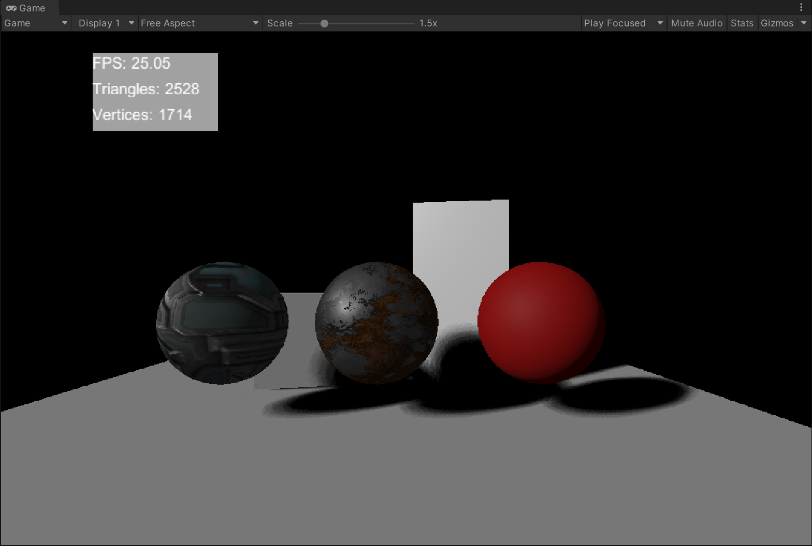
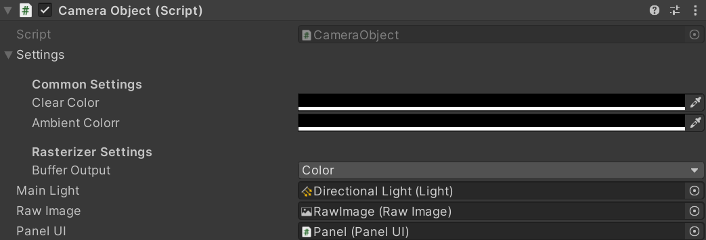
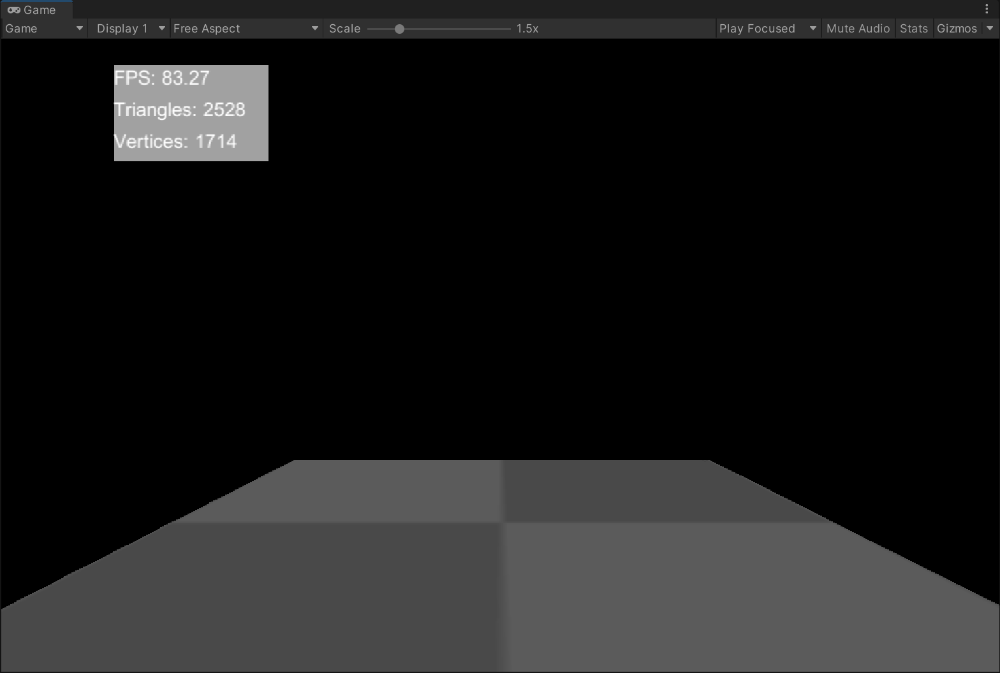
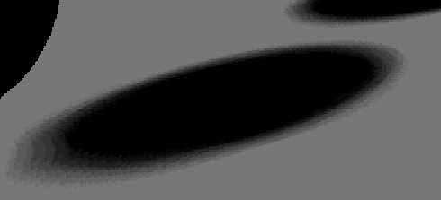
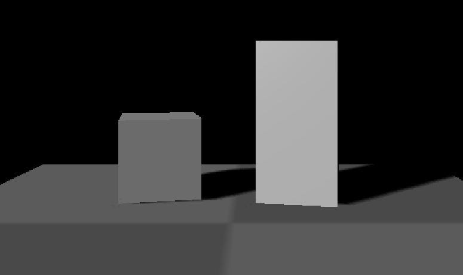
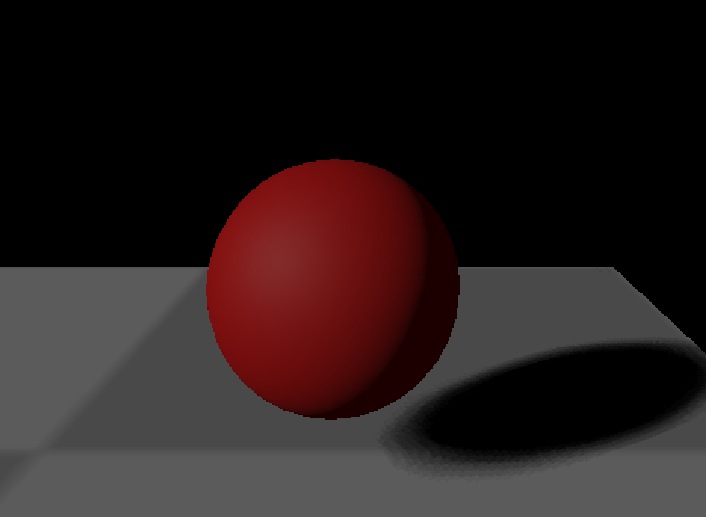
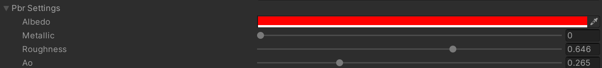
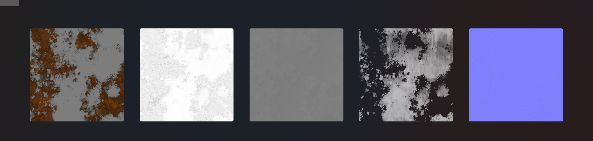
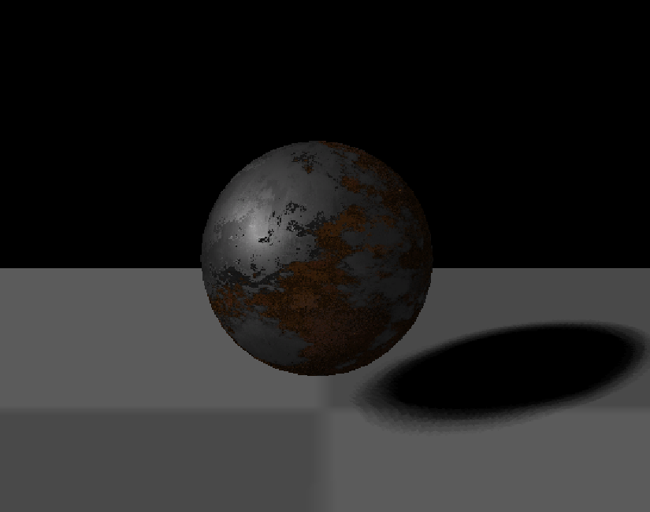
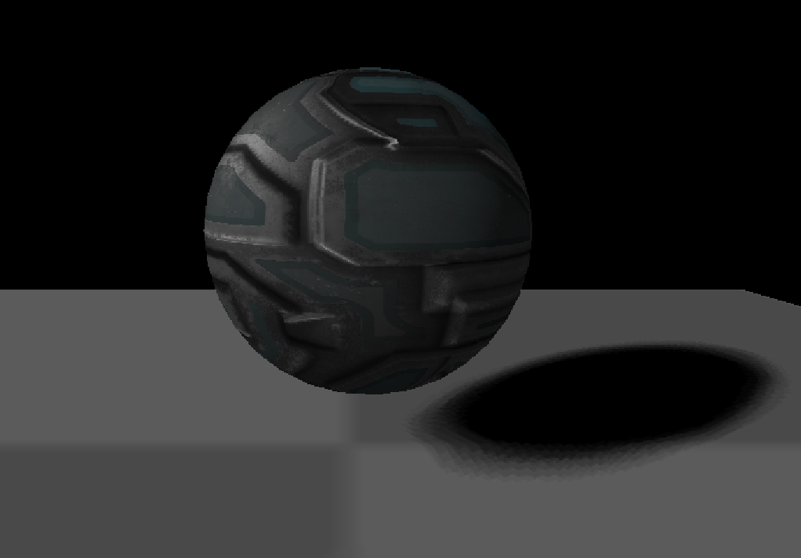

# SoftRenderer

## Introduction

A Software Rasterizer based on compute shader.

### Requirements

1. Unity version 2021.3 or more is recommended (support compute shader variants feature).
2. DirectX 11

### Main feature

- Basic logic and render pipeline are controlled by C# scripts while computing by compute shader.
- Basic rasterizer feature: z-test, frustum culling, backface culling, project correction, etc
- Hard shadow && soft shadow
- Blinn-Phong shading and PBR shading
- Frame buffer visualization: depth buffer, shadow map buffer and color buffer
- Support camera movement
- Show FPS, triangles and vertices number

### Rendering Overview

Bellows are using explanation whereas implementation details are as follows.

## Using Explanation

Open the Unity project and click run.

If "Cannot Find kernel variants with index(0)", then your Unity version maynot support compute shader variants but that matters little.

In order to prove that the running result is rendererd by our SoftRenderer instead of Unity built-in grpahics pipeline, the scene objects' material use black as default.

You can add new GameObject to scene and bind it with Render Object script. Then the GameObject will be added to rendering queue. Every Render Object supports Blin-phong, PRB parameters and PBR Texture three materials.

## Render Pipeline

The code are in file `Rasterizer/Scripts/Rasterizer.cs`, consist of such stages below:

1. Clear screen
2. Set Attributes
3. ShadowMap pass
4. Rasterize Pass
5. Update Per frame

## Rasterization

Stages below:

1. Put every `RenderObject`'s vertex, normal, uv to GPU buffer.
2. Transform every vertex to clip space by function `VertexTransform`.  
3. Function `RasterizeTriangles` rasterize every triangle:
   1. Do frustum culling in [-w, w] clip space
   2. Projection division
   3. Backface culling
   4. Screen mapping
   5. Main Rasterization Process: get every triangle's AABB and judge every pixel in AABB, calculate shading by fragment shader.

Projection correction and frustum culling works well:

## Soft shadow

PCF soft shadow with possion disk, details are in `Rasterizer\Shaders\Shadow.hlsl`中。

## Shading Model

### Blinn-Phong

Default shading function is Blinn-Phong

### PBR Material

Basic PBR material, use parameters as input or PBR texture as input.

Parameters PBR:

Parameters as follows:

PBR texture:

From left to right: Albedo、AO、Height、Metallic、Normal

Rendering results:

Another PBR material less metallic:

