# SoftRenderer
简介：基于Unity GPU驱动的软光栅渲染器。

Unity版本：**建议2021.3及以上的版本**（使用了compute shader变体的特性，但即使不支持也做了初始化配置，只是可能无法切换物体材质进行显示）

主要有如下特性：

- Unity C#脚本负责组织逻辑及渲染管线，compute shader负责所有计算。
- 实现了软光栅基本的深度测试、视锥剔除、背面剔除、透视矫正功能
- 支持软阴影
- Blin-Phong着色及PBR材质
- 支持多种buffer可视化：帧缓冲、深度缓冲以及ShadowMap
- 支持FPS、三角形数量以及顶点数量的显示

整体效果概览：

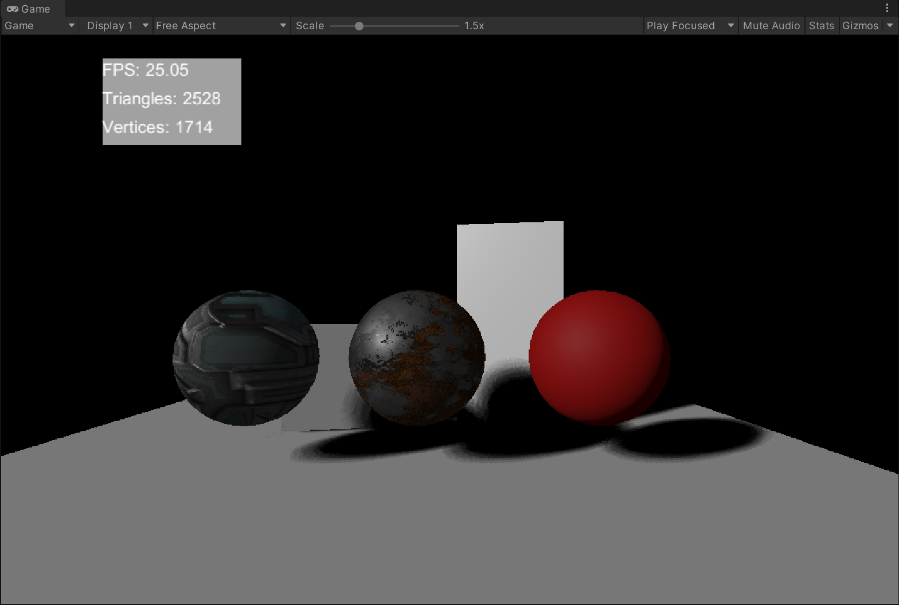

简单的软件使用说明如下所示，更加详细的实现结果及展示在后续内容。

## 使用说明

导入项目后点击运行即可执行文件，如出现`Cannot Find kernel variants with index(0)`等问题可能是**当前Unity版本不支持compute shader变体**，并非bug

为了自证**SoftRenderer是软光栅实现的效果而非Unity自己的渲染效果**，将场景中的物体材质均设置为了**Debug材质**，因此显示**黑色为正常**。在运行中可调整相机、平行光以及物体材质等检测软光栅结果。

运行后可通过键盘控制相机移动，**WSAD分别对应前后左右**，**QE分别对应上升和下降**，长按鼠标右键可控制相机旋转，滚轮可控制移动速度。

运行后可在Scene中调整相机清空帧缓冲的颜色，Blin-Phong模型中的Ambient颜色以及输出缓冲，输出缓冲支持帧缓冲、深度缓冲以及ShadowMap

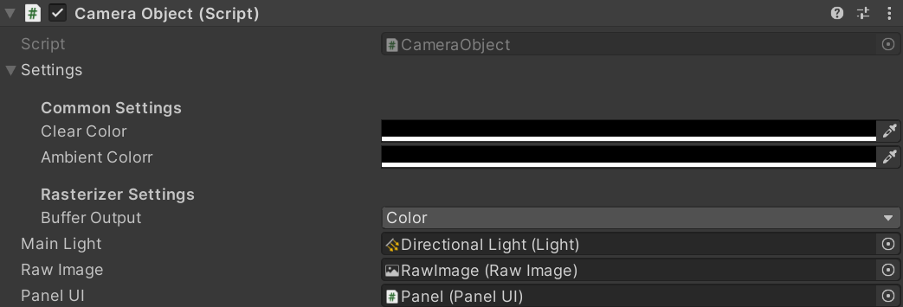

当然也可调整平行光的颜色、强度、方向位置等，**不建议调整平行光的方向**，可能会导致场景被剔除NDC空间导致ShadowMap输出为空出现阴影错误的问题。

在RenderObject中放置了每个可渲染的物体，可对每个物体调整材质相关信息，**如果Unity版本不支持compute shader变体会导致输出错误的问题**，不过项目已经默认在场景中RenderObject初始化了三种材质：Blin-Phong、基于参数的PBR材质和基于纹理的PBR材质，出现变体的Bug也不影响材质的输出查看，只是无法切换物体材质。

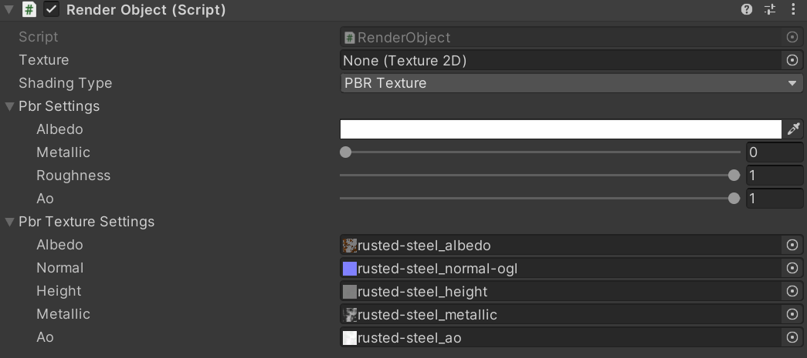

## 渲染管线

默认的逻辑组织在C#中实现，所有计算均在GPU上运行，因此GPU的性能直接决定了软光栅的帧率，本项目在GTX 1650上测试结果如开篇图所示，将GPU提升至GTX 1660ti帧率可直接翻倍。

渲染管线相关API在`Rasterizer/Scripts/Rasterizer.cs`文件中，分为如下几个阶段：

1. Clear screen: 清空帧缓冲、深度缓冲以及ShadowMap缓冲
2. Set Attributes: 设置与物体无关的相关参数，如相机位置、平行光方向、视口变换矩阵及投影矩阵等
3. ShadowMap pass: 第一趟pass跑以平行光为相机的MVP正交变换，做一遍深度测试将深度存入ShadowMap缓冲中。详细代码在`Rasterizer/Shaders/Resources/RasterizeShader.compute`中的`ShadowMapVertexTransform`和`Rasterizer/Shaders/Rasterization.hlsl`中的`ShadowRasterization`两个函数中。
4. Rasterize Pass: 第二趟pass跑当前相机的光栅化，传入每个顶点及三角形，做MVP变换、视锥剔除、背面剔除、透视除法、光栅化、透视矫正插值等等。详细代码在`Rasterizer/Shaders/Resources/RasterizeShader.compute`中的`VertexTransform`和`Rasterizer/Shaders/Rasterization.hlsl`中的`Rasterization`两个函数中。
5. Update Per frame: 更新每帧的帧率并显示在UI上

## 软光栅

软光栅主要分为如下几个步骤进行：

1. 将每个`RenderObject`的顶点、法线、三角形及UV等信息传入GPU buffer缓存中
2. 利用上文提到的`VertexTransform`函数将所有信息通过MVP转化到齐次坐标系下
3. 在`RasterizeTriangles`函数中处理每个三角形的光栅化过程，具体分为如下步骤：
   1. 在[-w, w]的齐次空间下做视锥剔除，思路较为简单：当前三角形所有点在平截头体外即剔除
   2. 透视除法：齐次空间到NDC空间
   3. 背面剔除：判断当前三角形平面法线与Z轴的夹角即可
   4. 屏幕空间映射：将NDC空间的xy坐标映射到屏幕上，将z坐标映射到[0, 1]内便于可视化及存储。
   5. 光栅化过程：主要在`Rasterization.hlsl`中的`Rasterization`函数中，对每个三角形取屏幕空间下的AABB，对AABB中的每个像素判定是否在三角形内部，如在内部则计算重心坐标、属性透视插值、深度检测，通过深度检测则进行着色计算并存入帧缓冲中

透视矫正及视锥剔除示意图如下图所示，可以看出透视后的uv贴图正确，且将场景中物体移出视锥后帧率有明显提升，说明视锥剔除效果良好。

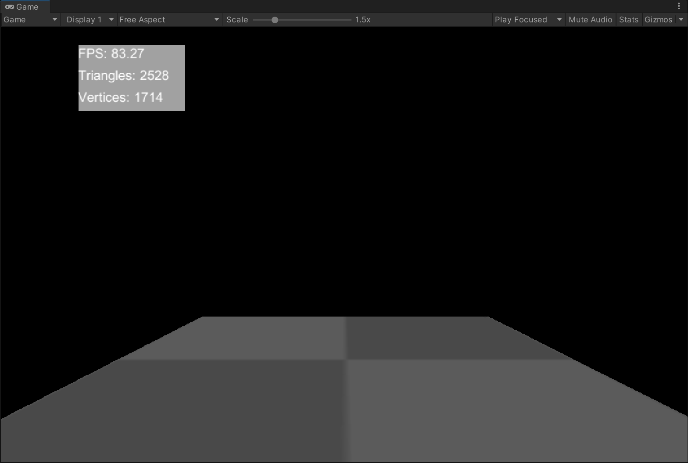

## 软阴影

采用PCF的方法实现软阴影，PCSS的代码也实现完成了但效果不甚理想。

PCF采用poisson disk采样的方式，计算周围样本的可见度取平均作为当前着色点的可见度

具体代码在`Rasterizer\Shaders\Shadow.hlsl`中。

效果如下图所示：

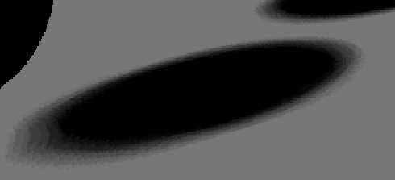

## 着色模型

### Blin-Phong

默认场景中的立方体采用Blin-Phong的方式进行着色，即传统的Ambient + Diffuse + Specular的方式计算。

如下图所示：

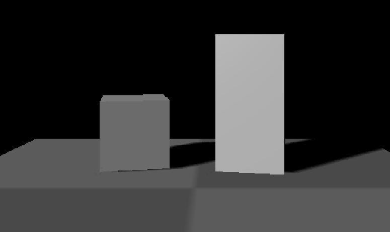

### PBR材质

项目模拟了基本的PBR材质实现，可采用参数作为输入或者PBR纹理作为输入。

采用参数模拟PBR效果为：

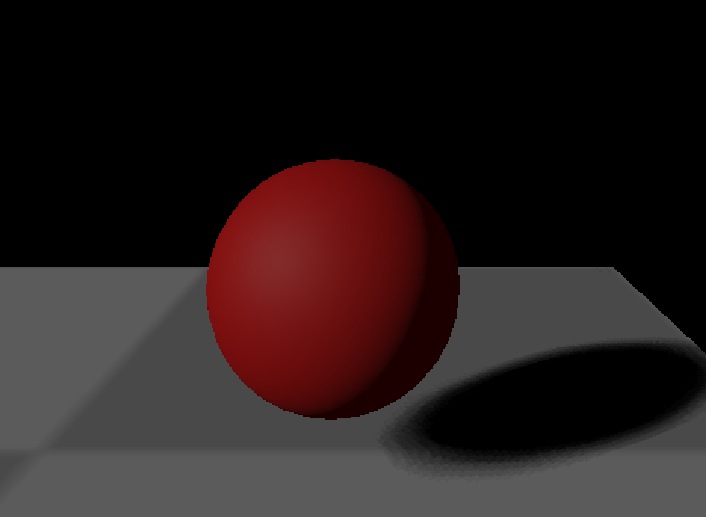

参数如下图所示，可自行调整：

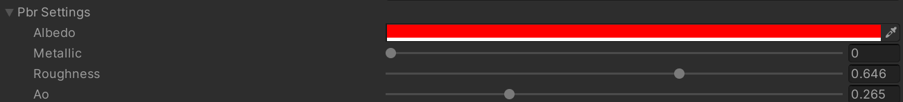

采用PBR纹理的方式作为输入：

从左到右分别为：Albedo、AO、Height、Metallic、Normal

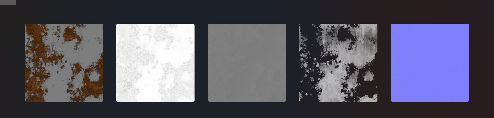

渲染结果如下图所示：

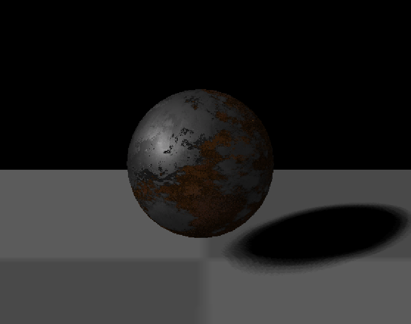

另外渲染了一种相对不Metallic的材质：

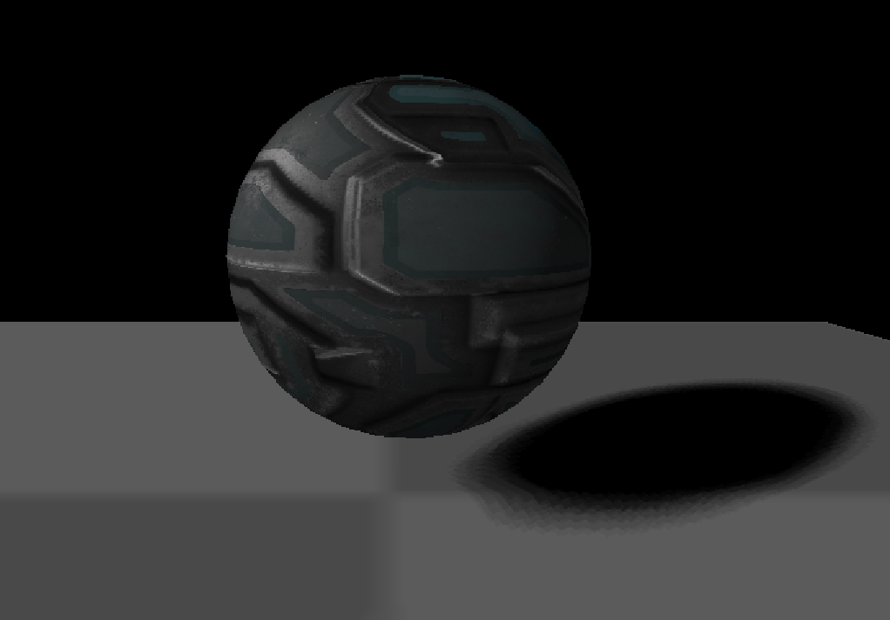